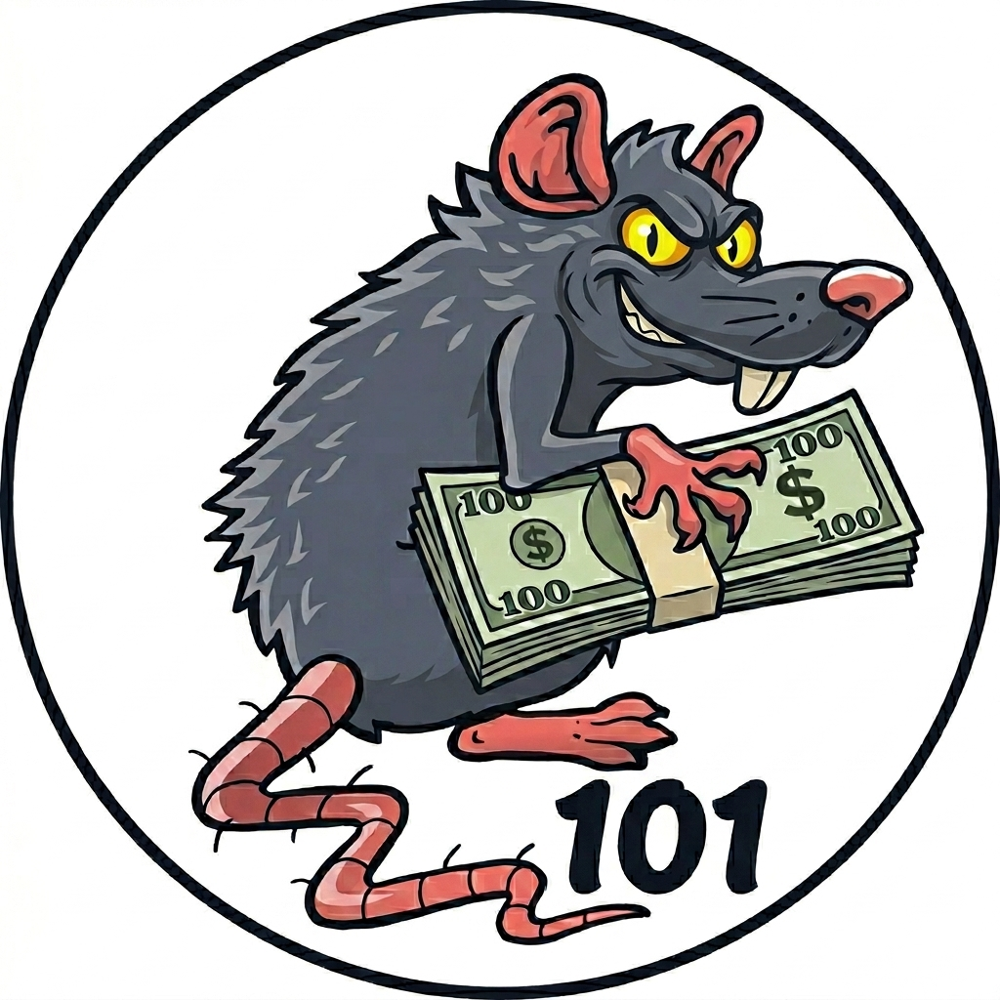

# CashFlow 101

Мобильное приложение — электронная замена бумажного бланка игры **CashFlow 101** (настольной финансовой игры Роберта Кийосаки). Считает всё за игрока: общий доход, расходы, пассивный доход, денежный поток, чистый капитал, выход из «крысиных гонок» и условие победы на «большом круге».

## Скриншоты / иконка

<p align="center">
  
</p>

## Возможности

### Базовое
- Welcome-экран с переключателем языка и большой кнопкой «Играть»
- До **4 локальных игровых профилей** с автосохранением (AsyncStorage), привязанных к слотам — можно вернуться к недоигранной партии в любой момент
- Стартовая карточка для одной из 12 профессий из настолки (Учитель, Врач, Пилот авиалиний и т.д.) с правильным сетом доходов/расходов/активов/пассивов
- Имя игрока и название профессии в текущей локали в шапке бланка

### Бланк (Statement)
- Полный пересчёт «Ведомости расходов и доходов»: зарплата, дивиденды, аренда, бизнес-cashflow, налоги, кредиты, дети, банковский кредит — всё в одной карточке
- Балансовый отчёт: активы (кэш, акции, недвижимость, бизнесы, ВТ-бизнесы) и пассивы (профессия + ипотеки сделок + банк) с подсчётом **чистого капитала**
- Индикатор «Условие выхода» — пассивный доход vs расходы, с прогрессом

### Действия (вкладка Actions)
- **День получки** — добавить месячный денежный поток в кэш
- **Сделки**: купить/продать акции (6 тикеров MYT4U/OK4U/ON2U/GRO4US/CD/2BIG, среднее по позиции, дивидендные акции), купить/продать недвижимость (малая/крупная сделка с автокомплитом из каталога), купить/продать бизнес
- **Семья** — добавить ребёнка (max 3, лимит из правил)
- **Финансы**: банковский кредит ($1000 кратно при взятии, **$10 минимум при погашении**, +$10/мес платёж за каждый $1000), закрытие пассивов профессии (полностью, обнуляет соответствующую строку расходов), мелкая трата (Doodad), **финансовая помощь от другого игрока** (благотворительность)
- **Партия** — сбросить в начальное состояние профессии

### Большой круг (Fast Track)
- Появляется кнопка «🎉 Выход доступен!» когда `пассивный ≥ расходы`. Подтверждение → новый стартовый пассивный доход = `округл. до $1000 × 100`
- Каталог из 18 ВТ-бизнесов с прибылью / разовой выплатой (IPO), первым взносом, условием на кубике (🎲 нужно 3+/4+/5+/6)
- Защита от повторной покупки одного бизнеса
- Snapshot бывшего бланка крысиных гонок остаётся доступен
- Win-индикатор «🏆 Победа!» при `+$50 000` к потоку или покупке мечты

### Локализация
- 4 языка: **🇷🇺 Русский** (по умолчанию), **🇬🇧 English**, **🇪🇸 Español**, **🇨🇳 中文**
- Переведены: главные экраны, заголовки сделок, имена 12 профессий, имена ВТ-бизнесов и каталогов недвижимости, alert-окна, плейсхолдеры
- Переключение мгновенное, без перезапуска

### Прочее
- Кастомный модал-Alert вместо системного (одинаковый вид на всех платформах)
- Тема: автоматическое следование системной (light/dark)
- Лог `history` всех действий в `PlayerState` — задел под undo

## Стек

- **Expo SDK 54** + React Native 0.81 + React 19
- **TypeScript** strict, `tsc --noEmit` в pre-commit
- **Expo Router** v6 (file-based)
- **Zustand 5** + `persist` middleware (AsyncStorage)
- **Zod 4** — валидация JSON-конфигов на старте, типы выводятся из схем
- **i18n-js 4** + `expo-localization`
- **EAS Build** — облачная сборка APK / iOS Simulator

## Структура

```
cashflow-app/
├── app/                       # экраны (Expo Router)
│   ├── index.tsx              # Welcome
│   ├── profiles.tsx           # выбор партии (до 4 слотов)
│   ├── setup.tsx              # выбор профессии + ввод имени
│   ├── (tabs)/                # игровые табы
│   │   ├── statement.tsx      # бланк (RR / FT views)
│   │   ├── balance.tsx        # балансовый отчёт
│   │   └── actions.tsx        # меню действий
│   ├── actions/               # формы действий (10 экранов)
│   ├── rat-race-snapshot.tsx  # snapshot бланка после выхода
│   └── _layout.tsx            # root Stack + AlertModal
├── components/
│   ├── alert-modal.tsx
│   ├── language-picker.tsx
│   ├── form-scroll.tsx        # ScrollView с safe-area inset
│   ├── rat-race-view.tsx
│   ├── fast-track-view.tsx
│   ├── themed-input.tsx
│   └── ...
├── config/                    # игровые данные (JSON)
│   ├── professions.json       # 12 профессий
│   ├── stocks.json            # тикеры
│   ├── small-deals.json       # каталог малых сделок
│   ├── big-deals.json         # каталог крупных сделок
│   ├── fast-track.json        # 18 ВТ-бизнесов
│   └── rules.json             # игровые коэффициенты
├── lib/
│   ├── schema.ts              # Zod
│   ├── types.ts               # PlayerState, ProfileSlot, GameEvent
│   ├── configs.ts             # импорт + валидация
│   ├── calculations.ts        # чистые формулы
│   ├── events.ts              # пьюр-мутаторы (buyStock, addChild, payOff…)
│   └── i18n/
│       ├── index.ts           # настройка i18n
│       └── locales/{ru,en,es,zh}.ts
├── store/
│   ├── profiles.ts            # Zustand: слоты + activeId + persist
│   ├── locale.ts              # язык + persist + useT хук
│   └── alert.ts               # глобальный модал
├── assets/images/             # иконки + сплэш
├── app.json
├── eas.json
└── package.json
```

См. `config/README.md` про формат игровых данных и редактирование без пересборки.

## Локальный запуск

```bash
# 1. Зависимости
npm install

# 2. Dev server
npx expo start
# → Откройте в Expo Go (Android/iOS) или нажмите 'w' для web
```

Минимально нужны Node.js 20+ и Expo Go на телефоне.

## Сборка APK

Через [EAS Build](https://docs.expo.dev/build/introduction/) в облаке:

```bash
# Авторизация (один раз)
npx eas-cli login

# Preview-билд (внутренняя дистрибуция, для тестов)
npx eas-cli build --platform android --profile preview

# Production-билд
npx eas-cli build --platform android --profile production
```

Профили в `eas.json`, оба выдают **`.apk`** (а не AAB) с `internal` distribution.

iOS-сборка для iOS Simulator (без Apple Developer аккаунта):
```bash
npx eas-cli build --platform ios --profile production
# → .tar.gz с .app, открывается в Xcode iOS Simulator на macOS
```

## Игровые данные — где править

Все цифры/названия в `cashflow-app/config/*.json`. Например, поправить зарплату Учителя — `professions.json` → `"teacher" → income.salary`. После запуска приложение валидирует JSON через Zod, и если схема нарушена, видно осмысленную ошибку.

Имена объектов локализуются через `lib/i18n/locales/{lang}.ts` под ключами `professions.<id>`, `smallDeals.<id>`, `bigDeals.<id>`, `fastTrackBusinesses.<id>`. Если перевода для языка нет — fallback на `name` из JSON.

## Лицензия / правила игры

CashFlow 101 — настольная игра Роберта Кийосаки. Это приложение — фан-инструмент для упрощения учёта во время игры, не реплика и не замена самой игры. Оригинальные правила и игровое поле — на стороне настольной коробки.

## Скачать

Готовые сборки — в [Releases](../../releases).
